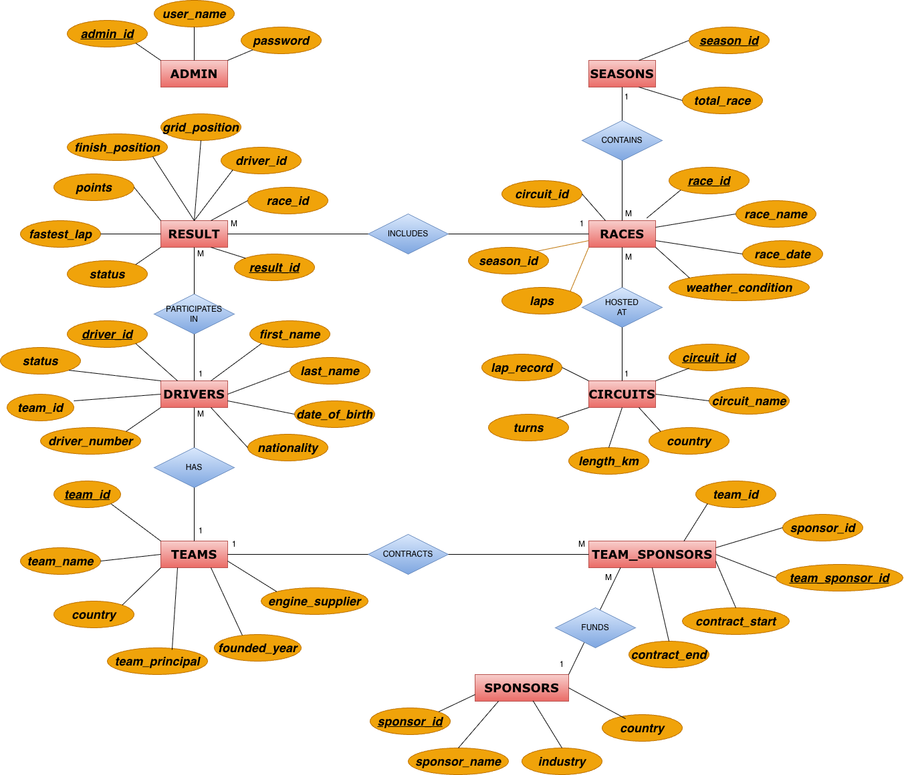

# 🏎️ F1 Championship Database Management System
Formula 1 Championship Management System built with MySQL and PHP, featuring normalized database design (3NF), many-to-many relationships, secure authentication and full CRUD operations

---

## 🗂️ Entity Relationship Diagram

Below is the database schema structure used in this project:

